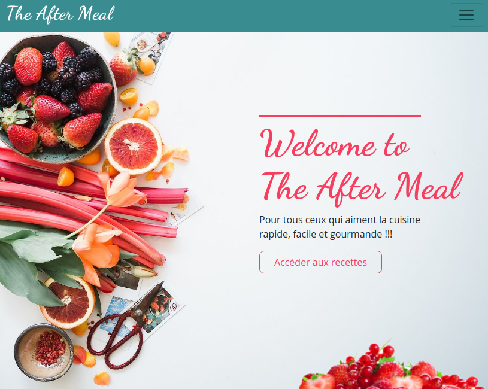

# Aftermeal

Aftermeal is a 2-weeks Bootstrap project, released by a two-person team. 
It is available at: https://aftermeal.netlify.app/.

## General uses
- Bootstrap 5
- Font Awesome 4.7.0
- Google font

## Uses of Bootstrap 5
- layout
  - grid
  - containers
  - columns
  - gutters
- content
  - typography
  - images
- form
  - input group
  - select
  - layout
  - validation
- components
  - button (block)
  - card
  - carousel
  - nav & tabs
  - navbar
  - pagination
- helpers
  - position
  - border
  - display
- Utilities
  - flex
  - overflow
  - position
  - text
  - sizing
  - spacing
  - vertical align
- Extend
  - icons